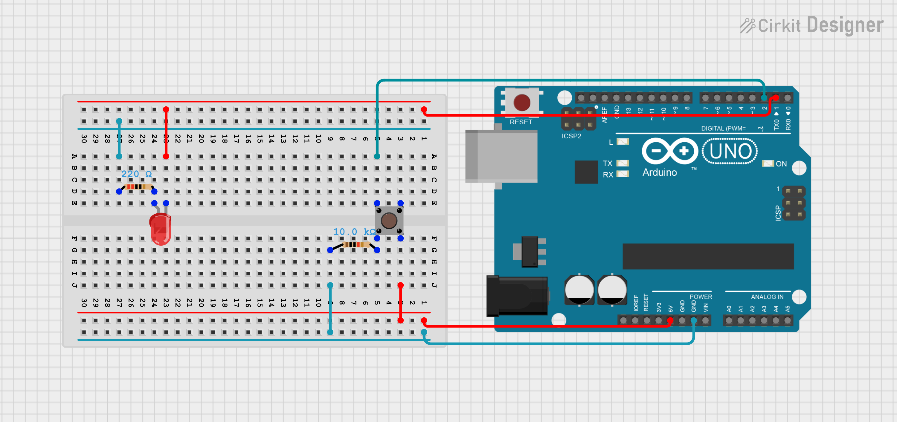

# Circuit Diagrams

## Purpose
This folder holds the wiring diagrams for the Arduino LED and button project. 

## Components Needed:
- Arduino Uno or Arduino Nano
- Breadboard
- LED
- 220Ω Resistor
- Push button
- 10kΩ resistor
- Jumper Wires

## Diagrams
### Arduino Nano
.png)
### Arduino Uno

## How the Circuits Work
The button is connected to the digital input on the Arduino's, and the LED is connected to a digital output. When the button is pressed, the Arduino will read the input signal and control the LEd based on the program that is loaded onto it. 

# Some important Notes
- We need to make sure that the LED is connected in the correct direction (long leg is positive).
- The 220Ω resistor will be used to protect the LED.
- The 10kΩ resistor will be used for the button to recieve stable input readings.
- Make sure and double check that all connections are in it's correct place before powering the circuit.

# Compatibility
This circuit setup can be used for both project versions:
- Button Hold Mode
- Toggle Mode

Only the code changes between versions.

### Future Improvements
Step-by-step wiring diagrams will be added later to make it easier for beginners. 

