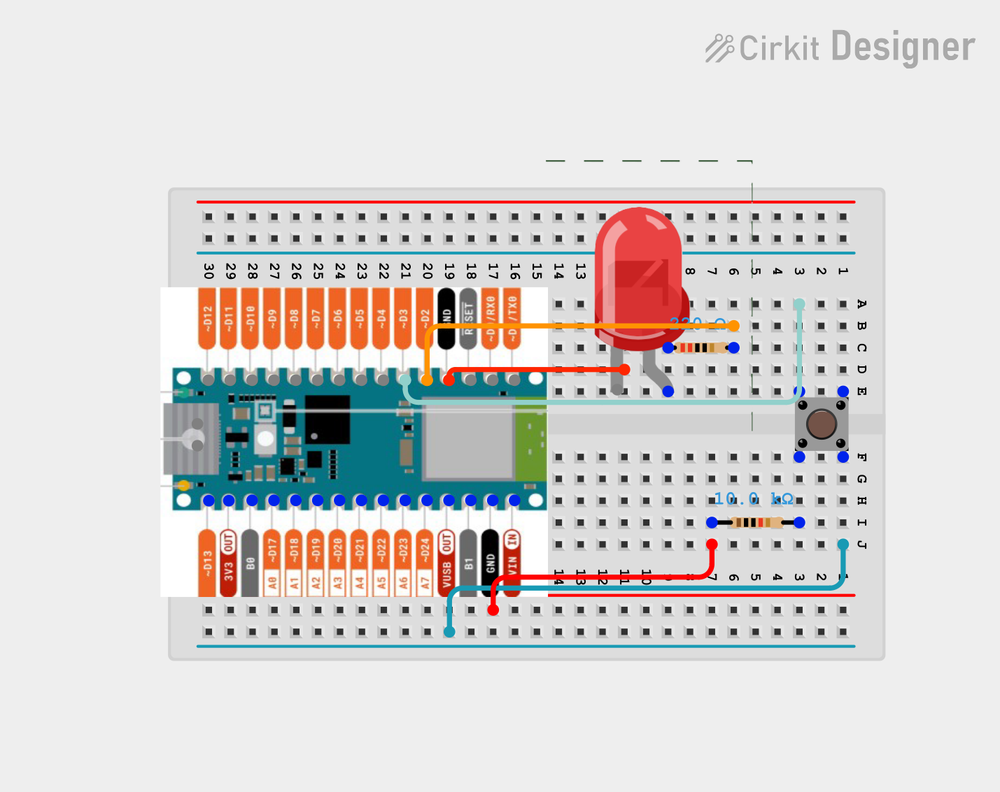

# Circuit Diagrams

## Purpose
This folder holds the wiring diagrams for the Arduino LED and button project. 

## Components Needed:
- Arduino Uno or Arduino Nano
- Breadboard
- LED
- 220Ω Resistor
- Push button
- 10kΩ resistor
- Jumper Wires

## Diagrams
### Arduino Nano

### Arduino Uno

## How the Circuits Work

