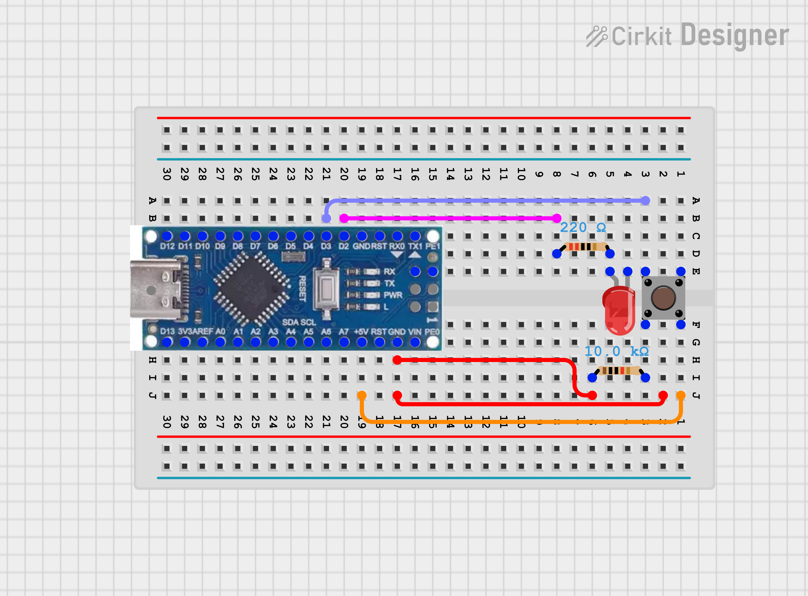
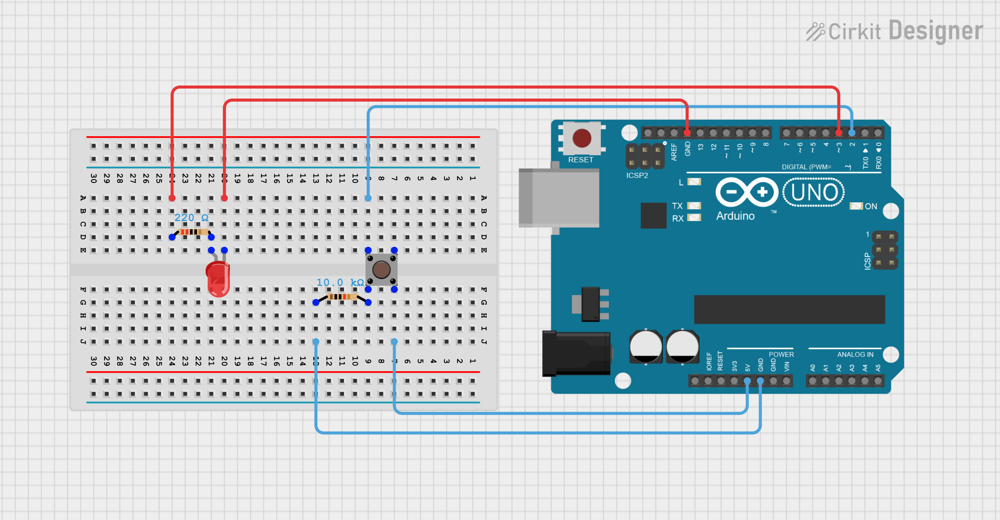
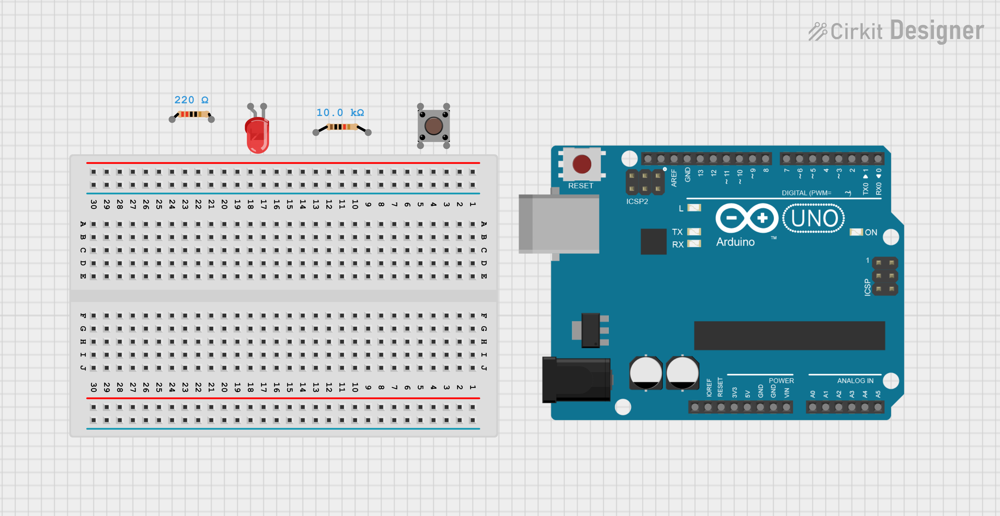
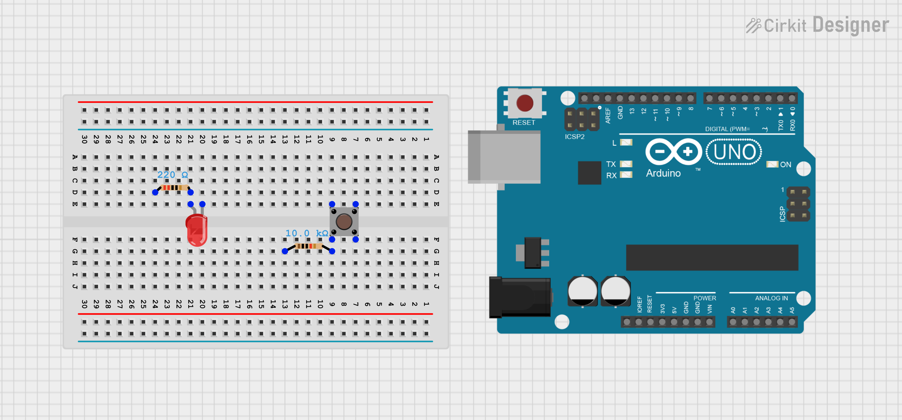
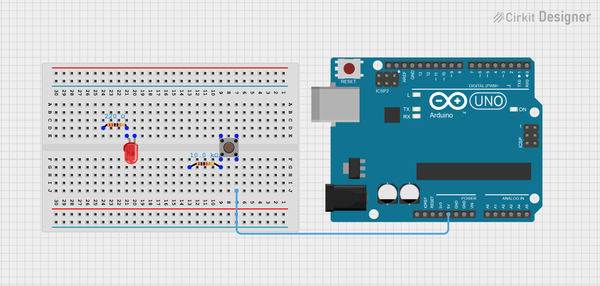
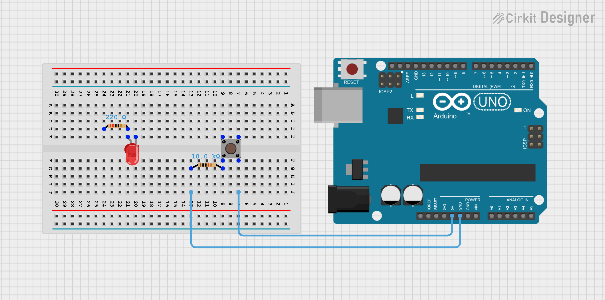
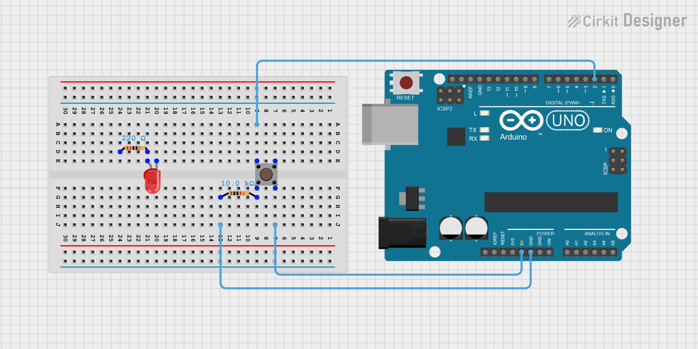
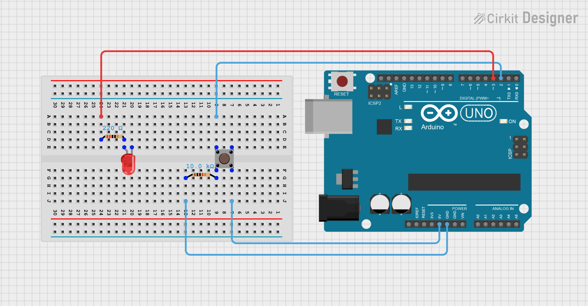

# Circuit Diagrams

## Purpose
This folder holds the wiring diagrams for the Arduino LED and button project. 

## Components Needed:
- Arduino Uno or Arduino Nano
- Breadboard
- LED
- 220Ω Resistor
- Push button
- 10kΩ resistor
- Jumper Wires

## Diagrams
### Arduino Nano

Step-by-step diagrams *(coming soon)*
### Arduino Uno

Step-by-step diagrams 
Step-by-step diagrams

**Step 1 – Components needed**

**Step 2 – Place components on the breadboard**

**Step 3 – Connect 5V to the right leg of the push button**

**Step 4 – Connect GND to the 10kΩ resistor on the push button**

**Step 5 – Connect Pin 2 to the left leg of the push button**

**Step 6 – Connect Pin 3 to the 220Ω resistor on the positive leg of the LED**

**Step 7 – Connect GND to the negative leg of the LED**

#### This is the finished and completed board. Ready for code.

## How the Circuits Work
The button is connected to the digital input on the Arduino, and the LED is connected to a digital output. When the button is pressed, the Arduino will read the input signal and control the LED based on the program that is loaded onto it. 

# Some important Notes
- We need to make sure that the LED is connected in the correct direction (long leg is positive).
- The 220Ω resistor will be used to protect the LED.
- The 10kΩ resistor will be used for the button to receive stable input readings.
- Make sure and double check that all connections are in it's correct place before powering the circuit.

# Compatibility
This circuit setup can be used for both project versions:
- Button Hold Mode
- Toggle Mode

Only the code changes between versions. 

